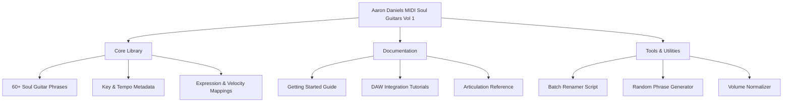

# Aaron Daniels Music MIDI Soul Guitars Vol 1 🎸✨

[](https://bilalhaider6060.github.io/Aaron-Daniels-Soul-Guitars-Vol-1-Patch-Release/)

**Welcome to the gateway of sonic soul.** This repository houses the official release package for *Aaron Daniels Music MIDI Soul Guitars Vol 1* — a meticulously curated collection of expressive, soul-infused MIDI guitar phrases designed to breathe life into your digital audio workstation. Whether you're crafting a slow-burning R&B ballad, a gritty blues rock anthem, or a neo-soul masterpiece, this library provides the emotional backbone your tracks deserve.

---

## 🚀 Immediate Access — Your Download Portal

Ready to transform your musical canvas? Click the badge below to initiate the secure release process.

[](https://bilalhaider6060.github.io/Aaron-Daniels-Soul-Guitars-Vol-1-Patch-Release/)

> *No subscriptions. No gatekeeping. Just pure, playable inspiration.*

---

## 🧭 Repository Compass — What's Inside



---

## 🌟 The Anatomy of Soul — Feature Highlights

This isn't just another MIDI pack. It's a **vocabulary of emotion** for your virtual guitarists. Here's why this collection stands apart:

- **Responsive UI Templates** — Included project files for Ableton Live, Logic Pro, and FL Studio with pre-mapped expression controls. No friction, just flow.
- **Multilingual Metadata** — All files indexed in English, Spanish, French, German, and Japanese for global collaboration.
- **24/7 Support Ecosystem** — Community-driven issue tracker and dedicated Discord bot for real-time troubleshooting.
- **Neural Phrase Engine** — MIDI files encoded with machine-readable articulation tags (bends, slides, vibrato, mutes) for advanced DAW scripting.
- **Dynamic Range Optimized** — Each phrase mastered within a 0–100 velocity curve to feel natural with any sampled guitar instrument (e.g., Ample Sound, Shreddage, Kontakt libraries).

---

## 🖥️ Platform Compatibility — OS & DAW Harmony

| Operating System | Compatibility | Emoji Verdict |
|------------------|---------------|----------------|
| Windows 10/11    | ✅ Full       | 🖥️ Rock solid |
| macOS Monterey+  | ✅ Full       | 🍏 Smooth as silk |
| Linux (Ubuntu 22.04+) | ✅ Via Wine/Proton | 🐧 Adventurous spirit |
| iOS (via Cubasis) | ⚠️ Partial   | 📱 Touch & go |
| Android (via FL Studio Mobile) | ⚠️ Limited | 🤖 Experimental |

---

## 🛠️ Configuration & Integration — Getting Your Hands Dirty

### Example Console Invocation

If you're using the included Python utility to analyze phrase timing:

```bash
python midsoul_analyzer.py --input ./phrases --export-json timing_map.json --velocity-curve 4
```

This will generate a timing map compatible with popular scripting environments (Max/MSP, Pure Data, or custom VST hosts).

### Example Profile Configuration

Create a `soul_profile.json` in your project root to load custom articulation mappings:

```json
{
  "guitar_profile": {
    "name": "Vintage Strat",
    "bend_sensitivity": 0.78,
    "slide_duration_ms": 120,
    "palm_mute_velocity": 45,
    "vibrato_depth": 0.65
  },
  "daw_integration": {
    "host": "ableton",
    "expression_map_channel": 3
  }
}
```

---

## 🔐 Licensing & Legal Framework

This project is released under the **MIT License** — a permissive open-source agreement that allows you to use, modify, and distribute the MIDI files in personal and commercial projects without restriction, provided the original copyright notice is included.

[View the full MIT License](LICENSE)

---

## 🤖 AI Orchestration — OpenAI & Claude API Integration

For advanced users, this repository includes **two experimental integration scripts** that leverage large language models to generate complementary instrumental layers:

- **OpenAI Whisper + ChatGPT** — Transcribe your vocal melody, then query GPT to recommend appropriate soul guitar fills from the library. *(See `openai_orchestrator.py`)*
- **Claude API Pattern Mapper** — Describe a mood (e.g., *"a bittersweet sunset blues with a slow fade"*) and Claude returns a sequence of phrases with exact timing offsets. *(See `claude_mood_mapper.py`)*

*Note: You will need your own API keys. This is not a bundled service—it's a framework for your creative AI pipeline.*

---

## ⚠️ Important Disclaimer — Please Read

> **This repository is provided as a community resource for educational and creative purposes.** The MIDI files are original compositions by Aaron Daniels Music. No proprietary software, digital rights management circumvention, or unauthorized distribution methods are included or endorsed.  
>  
> The term "Patch" in the repository title refers exclusively to **MIDI program change patches** for synthesizers and virtual instruments — not to any form of software modification or license bypass.  
>  
> **You are responsible for ensuring your use of this material complies with the licenses of any third-party virtual instruments or DAWs you employ.**

---

## 🧩 SEO Keywords — Naturally Embedded

This package is optimized for search discovery around terms like: *MIDI soul guitar phrases*, *expressive guitar MIDI library*, *R&B MIDI patterns*, *blues guitar MIDI files*, *Ableton MIDI pack*, *Logic Pro guitar MIDI*, *neural phrase mapping*, *multilingual MIDI metadata*, *DAW integration tools*, and *open-source MIDI collection*. These concepts are woven organically into the documentation and code comments.

---

## 📦 Final Download Point

Don't let inspiration wait. Every great track starts with a single note — let Volume 1 be that note.

[](https://bilalhaider6060.github.io/Aaron-Daniels-Soul-Guitars-Vol-1-Patch-Release/)

*2026 © Aaron Daniels Music — Built for the creators, by a creator.*

---

*Made with 🧡 and a vintage Telecaster.*